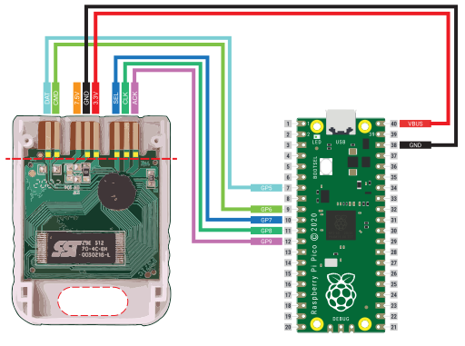

# PicoMemcard
PicoMemcard allows you to build your own supercharged PSX Memory Card that can be connected to your computer via USB in order to transfer saves directly to/from your PSX. Can be used to repurpose broken/counterfit Memory Cards into new ones using only a Raspberry Pi Pico.

## Features
* Able to simulate faithfully PSX Memory Card
* USB conection to import/export saves
* Allows to copy saves to/from any other memory card (using original PSX file manager)
* Compatible with [FreePSXBoot]
* Cheaper than a used original memory card.

## Bills of materials
* **Raspberry Pi Pico** (around ~5$)
* One of:
    * Custom PicoMemcard PCB (*currently work in progress*)
    * Broken/Counterfit/Original PSX Memory Card (counterfit ones can be found on Aliexpress for less than 1$)
    * PSX/PS2 Controller Cable
    * Nothing, if you are a mad man and feel like soldering cables directly to your PSX (would not recommend).

Basically anything that will allow you to interface with the memory card slot pins will do. If you have a broken contoller you can cut of the cable and use that since controllers and memory cards share the same bus. Of course, plugging your memory card into the controller slot will prevent you from using 2 controllers at the same time.

In total building a PicoMemcard wil cost you less than buying an used original Memory Card!

## How it works

## Wiring
The wiriting diagram below shows how to wire the Pi Pico and a counterfit memory card from Aliexpress. For the other cases (wiring directly to the PSX or using a controller cable) the pins on the Pico are the same, the pinout of the PSX/controller can be found on [psx-spx]. The image shows the bottom side of the memory card with the cover removed.

The dashed line on the PCB of the memory card is where you should cut a groove using a xacto knife deep enough to disconnect the original controller from the traces. The yellow squares above the line indicate where you should scrape away the proctective film in order to expose the traces and solder the wires onto.

Finally the area on the bottom part of the memory card is where I cut a hole to feed the wires through and connect them to the Pico.

## Installation
1. Download the latest [release].
2. While bressing the 'BOOTSEL' button on your Raspberry Pi Pico, plug it into your computer. 
3. Drag and drop the PicoMemcard onto your Raspberry Pi Pico.
4. PicoMemcard should appear on your PC as a USB drive.
5. Upload a memory card image to your PicoMemcard.

## Transfering Data
As of the current release, uploading data to PicoMemcard requires some precises steps:
* The image of the memory card to upload must be called exactly `MEMCARD.MCR`. Uploading anything else will not result in any errors but PicoMemcard will not save the uploaded data to flash, after rebooting the device the old data will still be present.
* The image must be 128KB (131072 bytes) in size which is precisely the size of an original Memory Card.
* After the image has been uploaded, the device **must be safely ejected** in order for the data to be actually imported correctly. This is a limitation of the current implementation (see Design section).

Inside `docs/images` you can find a couple of memory card images. One has a couple of saves on it so you can test if everything works correctly, the other is completely empty.

**ATTENTION:**
I would recommend to never plug the PicoMemcard both into the PC (via USB) and the PSX at the same time! Otherwise the 5V provided by USB would end up on the 3.3V rail of the PSX. I'm not really sure if this could cause actual damage but I would avoid it.

If you really need to have the Pico plugged into both the USB and PSX (e.g. for debugging purposes), disconnect the 3.3V line from the VBUS pin. In this way you can power on the Pico using a simple USB phone charger or by plugging it into your PC.

## Future Development
As of now PicoMemcard is still in very early development stages and only tested it on a PSOne Pal model (SCPH-102, bios version 4.4) and may work or not on your PSX. If you want to try it on your PSX any feedback would be much appreciated.

I've tried to make the project as accessible as possible by using the least amount of hardware but this comes with a few limitations, in particular regarding the flash storage of the Pico. In the future I want to add the possibility to use a microSD card by adding a microSD SPI module, this would improve on the following:
* The very limited storage preventing from having multiple memory card images at the same time and being able to switch them using a button on the Pico.
* The complex codebase using multiple filesystems (see [Design](#design) section).
* The brief downtime periods PicoMemcard may have while writing new data to flash memory, appearing as if the Memory Card was briefly disconnected.
* The need to perform save ejection as a way to signal the Pico to transfer the data from the virtual FAT disk to the flash filesystem (see [Design](#design) section).

## Design
For people interested in underestanding how PicoMemcard works I provide a more extensive explanation in [this post].

## Thanks To
* [psx-spx] and Martin "NO$PSX" Korth - Playstation Specifications and documented Memory Card protocol and filesystem.
* [Andrew J. McCubbin] - Additional information about Memory Card and Controller comunication with PSX.
* [littlefs] - Filesystem designed to work on NOR flash used by many microcontrollers, including the Raspberry Pi Pico.
* [ChaN FatFS] - FAT filesystem implementation for embeeded devices.
* [Scoppy] - Use your Raspberry Pi Pico as an oscilloscope, very cheap and accurate. Without this I would have not been able to debug many issues.
* [PulseView] - Used to import, visualize and manipulate the data from Scoppy on a PC.

[FreePSXBoot]: https://github.com/brad-lin/FreePSXBoot
[psx-spx]: https://psx-spx.consoledev.net/pinouts/#controller-ports-and-memory-card-ports
[Andrew J. McCubbin]: http://www.emudocs.org/PlayStation/psxcont/
[littlefs]: https://github.com/littlefs-project/littlefs
[ChaN FatFS]: http://elm-chan.org/fsw/ff/00index_e.html
[Scoppy]: https://github.com/fhdm-dev/scoppy
[PulseView]: https://sigrok.org/wiki/PulseView
[release]: https://github.com/dangiu/PicoMemcard/releases/latest
[this post]: https://dangiu.github.io/2022/05/13/picomemcard.html

<!-- 
TODO
Add FAQ? Is it necessary?
Add Changelog
-->