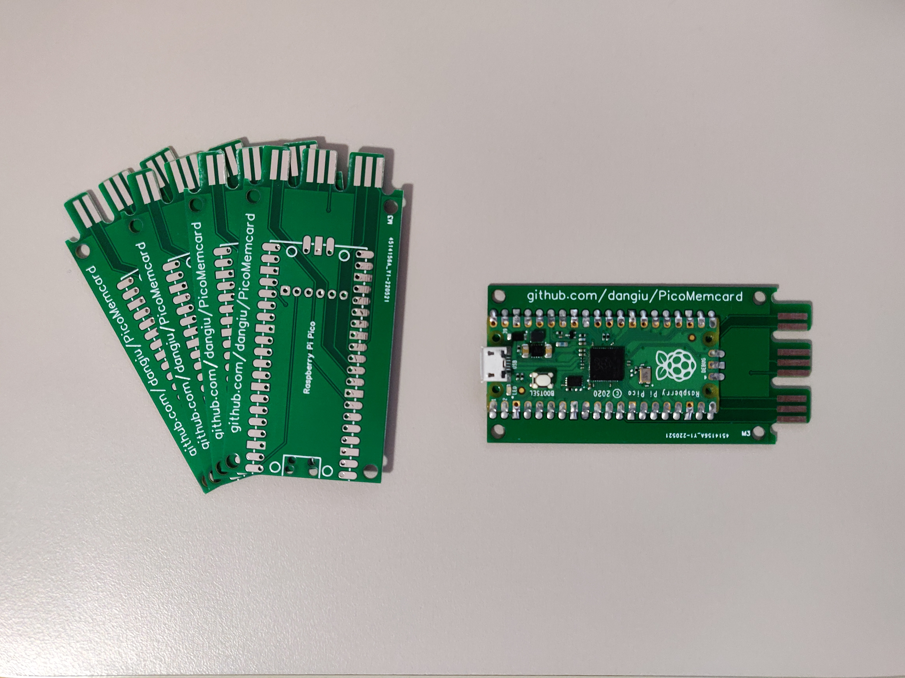
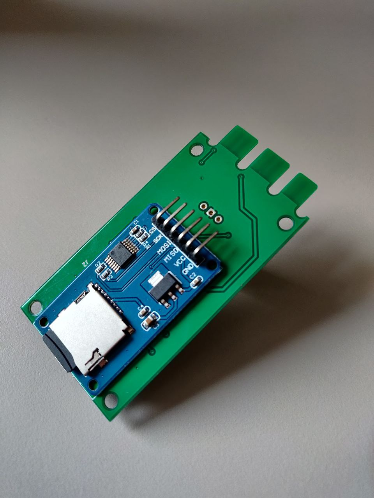
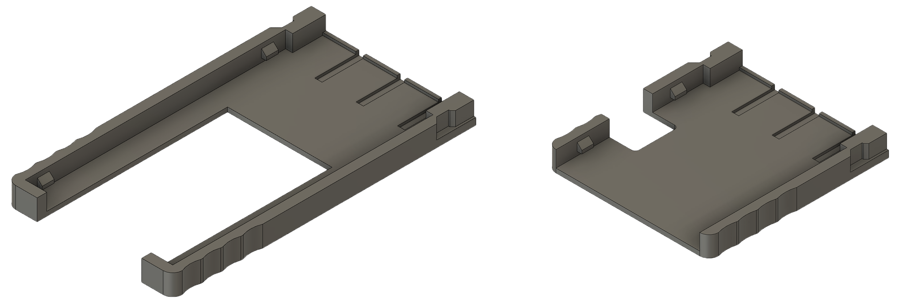
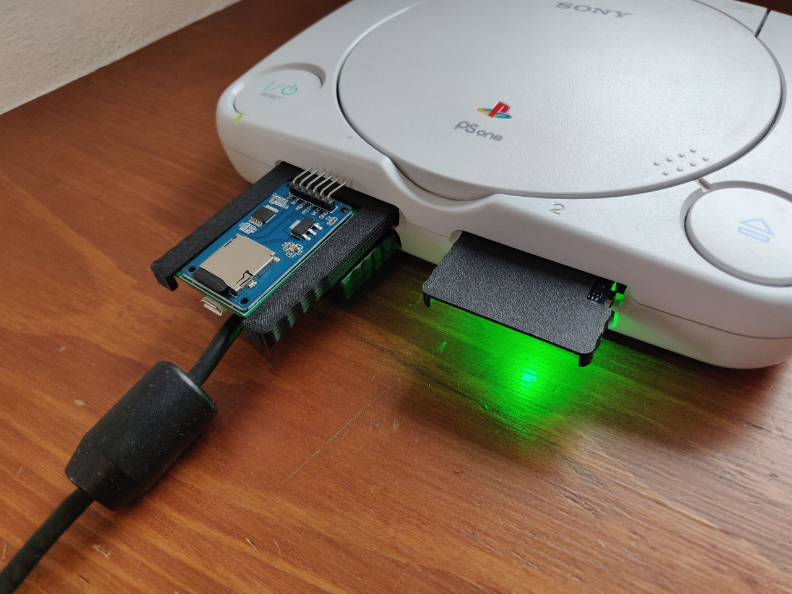

# PicoMemcard

PicoMemcard allows you to build your own supercharged PSX Memory Card that can be connected to your computer via USB in order to transfer saves directly to/from your PSX. You can use it to repurpose broken/counterfeit Memory Cards creating a better one using only a Raspberry Pi Pico.

## Features
* Able to faithfully simulate PSX Memory Card
* USB connection to import/export saves
* Allows to copy saves to/from any other memory card (using original PSX file manager)
* Allows to play burned CDs (thanks to [FreePSXBoot])
* Cheaper than an original memory card
* Can store hudreds of memory card images

## Bill of materials
* **Raspberry Pi Pico** (around $5)
* One of:
    * Custom [PicoMemcard PCB](#picomemcard-pcb)
    * Broken/Counterfeit/Original PSX Memory Card (counterfeit ones can be found on AliExpress for around $2-3)
    * PSX/PS2 Controller Cable
    * CAT5 network cable and a bit of creativity.

Basically anything that will allow you to interface with the memory card slot pins will do. If you have a broken contoller you can cut off the cable and use that since controllers and memory cards share the same bus. Of course, plugging your memory card into the controller slot will prevent you from using 2 controllers at the same time.

[This guy] assembled one using a 3d-printed plastic shell and simple CAT5 network cable. I belive this is the cheapest method anybody has come up with until now.

In total building a PicoMemcard wil cost you less than buying a used original Memory Card!

## Video

## PicoMemcard PCB

These are the custom PCBs designed and manufactured specifically for this application. They are not strictly required but make it much easier to build PicoMemcard since you don't need to cut up another memory card and all the soldering pads are easily accessible. All you need to do is to solder the Pico/RP2040-Zero on top of the PCB using a soldering iron.

The Raspberry Pi Pico or RP2040-Zero must sit flush on top of the PCB, fortunately both the Pico and RP2040-Zero provide castellated holes that are easy to solder directly to the PCB's pads. You can use some electrical tape to hold the board in place while you solder the first pins.

At the moment there are 3 variations of the PCB, going from left to right:
* PCB compatible with Raspberry Pi Pico supporting SD Card.
* PCB compatible with RP2040-Zero supporting SD Card.
* Mini PCB compatible with RP2040-Zero not supporting SD Card. This has the same size as the original chip inside Memory Cards so it can be simply dropped in place (you will need to cut a small notch into the shell to let the USB Type C stick out).

If you want to request a PCB you can do it [from here]. I plan to eventually make the PCB design open source as well so people can more easily get access to it. I just need a bit more time to finalize it.

## PicoMemcard using Memory Card
Raspberry Pi Pico and RP2040-Zero require different pin usage for full compatibility.

The wiring diagrams below show how to build PicoMemcard by wiring respectively a Pico and an RP2040-Zero to a counterfeit memory card. For the other cases (wiring directly to the PSX or using a controller cable) the pins on Pico and RP2040-Zero are the same, the pinout of the PSX/controller can be found on [psx-spx]. The images show the bottom side of the memory card with the cover removed.

The dashed line on the PCB of the memory card is where you should cut a groove deep enough to disconnect the original circuitry from the traces. The yellow squares above the line indicate where you should scrape away the protective film in order to expose the copper traces and solder the wires onto them.

Finally the area at the bottom of the memory card is where you can cut a hole to feed the wires through connecting them to the Pico.
If you are using an RP2040-Zero you can also cut away part of the original Memory Card circuitry to fit it inside the original shell.

The connections in the PicoMemcard+ area are optional and only required if you want to build **PicoMemcard+** (using the optional MicroSD expansion board). Also remember to connect both ground and power to your SD card module (see [MicroSD Module](#microsd-module-for-picomemcard) section for more information).

## PicoMemcard vs PicoMemcard+
Since some features cannot be implmented when using only a Pico/RP2040-Zero but require additional hardware, I've decided to split the project in two versions:
* **PicoMemcard** simplest device to build, only requires a Raspberry Pi Pico / RP2040-Zero
* **PicoMemcard+** more complex and powerful device. Supports additional features such as multiple memory card images but requires additional hardware (namely the MicroSD SPI expansion board).

This approach was choosen because many people want a solution that is as cheap as possible and don't care about additional features. Conversely, others would like to have additional features even if it means spending a bit more money.

The current release of PicoMemcard+ additionally to all the features of PicoMemcard supports:
* Trasparent write-back: the sync operation performed to save new data no longer reults in the memory card appearing as if was briefly disconnected.
* Multiple memory card image switchable through controller input.

## MicroSD Module for PicoMemcard+
There are many variations of MicroSD expansion boards with different pinouts and interfaces. The only requirement for PicoMemcard+ is that the module must provide an SPI interface. SPI interfaces have at least the following pins:
* Chip Select (CS) (sometime also called Slave Select (SS)).
* Clock (SCK or CLK).
* Master Output Slave Input (MISO).
* Master Input Slave Output (MOSI).

In addition you will need to connect power and ground to your module, some modules are design to work with 5V others with 3.3V (or both), luckily for us both voltages are available on Pico and RP2040-Zero as shown in the schematic in the section [above](#picomemcard-using-memory-card). Some module provides additional pins that can be left disconnected.

Both the original PicoMemcard PCB and the v1.1 Revision were designed with the following module in mind, which was the cheapest one I could find on Aliexpress at the time.

If you have the same module, or your module has the same pinout you can solder it directly to the other side of the PCB in the outlined area. Otherwise, if your module has a different pinout, you will need to solder manually cables in order to rearrange the connections.

Future version of the PCBs will likely use a different module such as this one:

Mainly for two reason:
* It comes withouth pre-soldered headers which makes it easier to solder onto the PicoMemcard PCB.
* Its smaller form factor allows for more flexibility.

A good source for modules is Aliexpress, in general you can search for `MicroSD SPI Expansion Board`.

## Installation
1. Download the latest [release] for your board (Raspberry Pi Pico and RP2040-Zero require different binaries).
2. While pressing the 'BOOTSEL' or 'BOOT' button on your board, plug it into your computer. 
3. Drag and drop the PicoMemcard release onto your Raspberry Pi Pico.
4. PicoMemcard should appear on your PC as a USB drive.
5. Upload a memory card image to your PicoMemcard.

## Transfering Data
Memory card images must be exactly 128KB (131072 bytes) in size. PicoMemcard and PicoMemcard+ only support files with `.MCR` extensions. However, `.MCR` and `.MCD` extensions are interchangable and can be converted to one another simply via renaming.
For other file formats, try using [MemcardRex] for converting to the desired output.

* **PicoMemcard** only supports a single image which must be named exactly `MEMCARD.MCR`.
* **PicoMemcard+** supports hundreds of images. Each image must be named `N.MCR` where `N` is an integer number (e.g. `0.MCR`, `1.MCR`...). On boot the first image loaded will always be the one with the lowest number.

Inside `docs/images` you can find two memory card images. One has a couple of saves on it so you can test if everything works correctly, the other is completely empty.

## Switching/Creating Images
On **PicoMemcard+** you can switch the active memory card image with the following inputs:
* `START + SELECT + DPAD UP` will switch to the next image (e.g from `1.MCR` to `2.MCR`).
* `START + SELECT + DPAD DOWN` will switch to the previous image (e.g from `1.MCR` to `0.MCR`).

Additionally you can create a new empty memory card image (and automatically switch to it) by pressing  `START + SELECT + TRIANGLE`.

**Attention**: this method only works on PSX if the controller used to provide the input is plugged in the same slot as PicoMemcard (exactly under it). Using a controller from a different slot will have no effect.

Additionally this method does not work on PS2 Memory Cards and Controllers are wired on a different bus.

## Syncing Changes
Generally speaking, new data written to PicoMemcard (e.g. when you save) is permanently stored only after a short period of time (due to hardware limitation). The on board LED indicates whether all changes have been stored or not, in particular:
* On Rapsbery Pi Pico the LED will be on when all changes have been saved, off otherwise.
* On RP2040-Zero the LED will be green when all changes have been saved, yellow otherwise

Unlike **PicoMemcard+** that tries to write new changes as soon as possible, **PicoMemcard** will generally do it only after a period of inactivity (around 5 seconds). If you want to force **PicoMemcard** to immediately sync you can press `START + SELECT + TRIANGLE`.

**Attention**: after you save your game, make sure to wait for the LED to be green before turning off the console otherwise you might lose your more recent progress!

## 3D-Printed Case
I've finally designed a 3D-printable case for the different PicoMemcard PCBs. It helps inserting correctly the PCB and ensuring that the the connection to the PSX is optimal. The same result, albeit more janky, can be achieved using a folded sheet of paper as a spacer.

The cases are designed following a minimalistic approach, they consist of a single piece which holds tightly the PCB using very small clips without requiring any additional hardware. To assemble it, simply slide in the PCB from the back of the case (opposite to the side connecting to the PSX). Cases for the fullsize PCB are designed to support the MicroSD expansion module.

Here is the download for the STL files:
* [Design by DanGiu](https://www.thingiverse.com/thing:5488778)

If you don't like this case you can check out other designs many people have already created! I've not tested them personally but here they are:
* [Design by brik1111](https://www.thingiverse.com/thing:5453156)
* [Design by bbsan2k](https://www.thingiverse.com/thing:5460187)

## Troubleshooting and LED Indicator
Generally speaking the onboard LED will provide a pretty good indication regarding the status of PicoMemcard.

In particular, the RP2040-Zero has RGB LED that provides a more clear output. The Pico on the other hand as only a green LED and different blinking patterns indicate different statuses.

### PicoMemcard Status
| Status | Pico | RP2040-Zero
| --- | --- | --- |
| Failed to read memory card image | Slow blinking led  | Red blinking led
| Data not fully synced (do not turn off PSX)| Led off | Yellow led |
| Data synced | Led on | Green led |

### PicoMemcard+ Status
| Status | Pico | RP2040-Zero
| --- | --- | --- |
| Failed to read SD card | Blinking led  | Red blinking led
| Data not fully synced (do not turn off PSX)| Led off | Yellow led |
| Data synced | Led on | Green led |
| Memory Card image changed | Three fast blinks | Single blue blink |
| Memory Card image not changed (end of list) | Nine fast blinks | Single orange blink |
| New Memory Card image created | Multiple very fast blinks | Single light blue blink |

## General Warnings
I would recommend to never plug PicoMemcard both into the PC (via USB) and the PSX at the same time! Otherwise the 5V provided by USB would end up on the 3.3V rail of the PSX. I'm not really sure if this could cause actual damage but I would avoid risking it.

If you really need to have the Pico plugged into both the USB and PSX (e.g. for debugging purposes), disconnect the 3.3V line from the VBUS pin. In this way you can power on the Pico using a simple USB phone charger or by plugging it into your PC.

As a disclamer, I don't take any responsability for what will happen to your console when using PicoMemcard/PicoMemcard+.

## Future Development
PicoMemcard has been tested on numerous PSX and PS2 models and **should** work on all of them. For now it only supports PSX memory cards emulation (even on PS2 hardware). PS2 memory card emulation is the next logical step.

## Design
For people interested in understanding how PicoMemcard works I provide a more extensive explanation in [this post] (although now somewhat outdated).

## Thanks To
* [psx-spx] and Martin "NO$PSX" Korth - PlayStation Specifications and documented Memory Card protocol and filesystem.
* [Andrew J. McCubbin] - Additional information about Memory Card and Controller communication with PSX.
* [littlefs] - Filesystem designed to work on NOR flash used by many microcontrollers, including the Raspberry Pi Pico.
* [ChaN FatFS] - FAT filesystem implementation for embedded devices.
* [Scoppy] - Use your Raspberry Pi Pico as an oscilloscope, very cheap and accurate. Without this I would have not been able to debug many issues.
* [PulseView] - Used to import, visualize and manipulate the data from Scoppy on a PC.

[FreePSXBoot]: https://github.com/brad-lin/FreePSXBoot
[psx-spx]: https://psx-spx.consoledev.net/pinouts/#controller-ports-and-memory-card-ports
[Andrew J. McCubbin]: http://www.emudocs.org/PlayStation/psxcont/
[littlefs]: https://github.com/littlefs-project/littlefs
[ChaN FatFS]: http://elm-chan.org/fsw/ff/00index_e.html
[Scoppy]: https://github.com/fhdm-dev/scoppy
[PulseView]: https://sigrok.org/wiki/PulseView
[release]: https://github.com/dangiu/PicoMemcard/releases/latest
[this post]: https://dangiu.github.io/2022/05/13/picomemcard.html
[from here]: https://forms.gle/f6XHtz6W5fn5qDZV7
[This guy]: https://github.com/MrSVCD/PicoPSX_3D
[MemcardRex]: https://github.com/ShendoXT/memcardrex