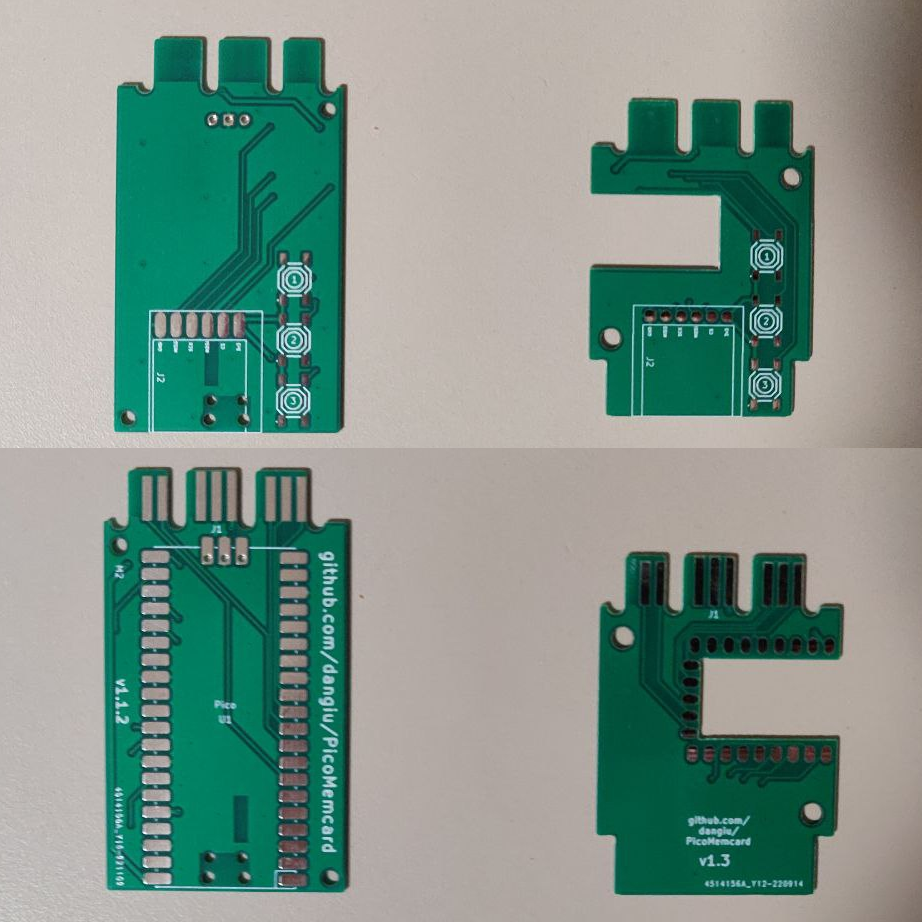
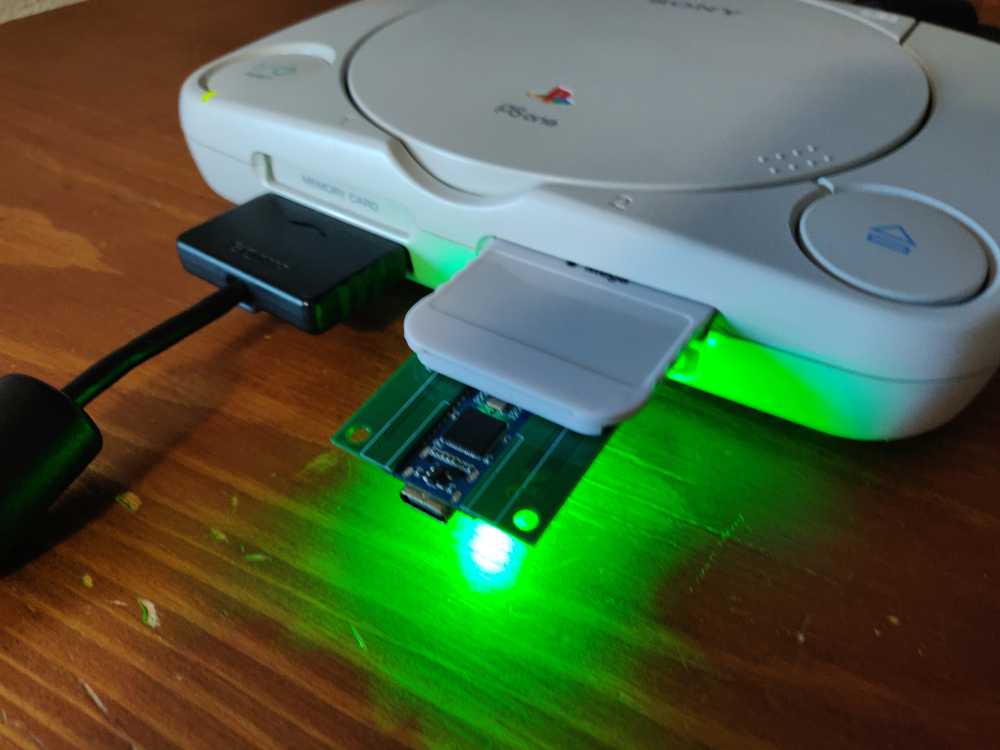
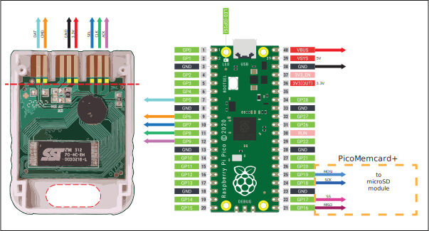
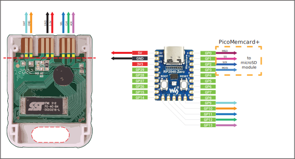
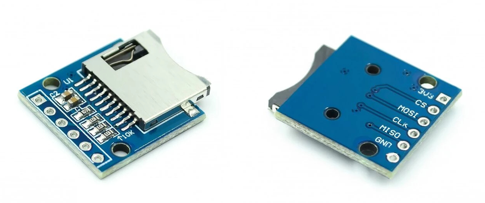

# PicoMemcard
PicoMemcard allows you to build your own supercharged PSX Memory Card that can be connected to your computer via USB in order to transfer saves directly to/from your PSX. You can use it to repurpose broken/counterfeit Memory Cards creating a better one using only a Raspberry Pi Pico.

## Features
* Able to faithfully simulate PSX Memory Card
* USB connection to import/export saves
* Allows to copy saves to/from any other memory card (using original PSX file manager)
* Allows to play burned CDs (thanks to [FreePSXBoot])
* Cheaper than an original memory card
* Can store hudreds of memory card images

## Bill of materials
* **Raspberry Pi Pico** (around $5)
* One of:
    * Custom [PicoMemcard PCB](#picomemcard-pcb)
    * Broken/Counterfeit/Original PSX Memory Card (counterfeit ones can be found on AliExpress for around $2-3)
    * PSX/PS2 Controller Cable
    * CAT5 network cable and a bit of creativity.

Basically anything that will allow you to interface with the memory card slot pins will do. If you have a broken contoller you can cut off the cable and use that since controllers and memory cards share the same bus. Of course, plugging your memory card into the controller slot will prevent you from using 2 controllers at the same time.

[This guy] assembled one using a 3d-printed plastic shell and simple CAT5 network cable. I belive this is the cheapest method anybody has come up until now.

In total building a PicoMemcard wil cost you less than buying a used original Memory Card!

## Video
Video of newest release coming soon.

<!-- TODO add new video -->

## PicoMemcard PCB

These are the custom PCBs designed and manufactured specifically for this application. They make it much easier to build PicoMemcard since you don't need to cut up another memory card and all the soldering pads are easily accessible. Still, you will need a soldering iron to assemble the device.

The Raspberry Pi Pico or RP2040-Zero must sit flush on top of the PCB, so use the soldering pads instead of the through-holes (see right side of the picture). You can use some electrical tape to hold the board in place while you solder the first pins.

I've created a new version of the original PCBs the major difference are:
* The general size is smaller
* A new micro SD card module is supported. This module is smaller, easier to solder and should solve some of the power related issues that were previously present
* Is fitted for the installation of phisical switches used to switch memory card when PicoMemcard+ is used in systems that do not support switching via controller input (e.g. all PS2 models).

The KiCad and Gerber files are available in the repository. If you want to support the project you can request a PCB [from here]. 
Keep in mind that with the PS2 support release that will eventually happen the PCB may undergo some additional changes before its design is finalized.

In the picture above you can see the full-size RP2040-Zero PCB plugged into a PSOne. I'm finally getting a 3d printer to work on a custom enclosure. In the meantime you can either use some paper sheets as spacers or the top side of a memory card shell to help align the PCB as shown in the picture.

## Wiring
Raspberry Pi Pico and RP2040-Zero require different pin usage for full compatibility.

The wiring diagrams below show how to wire respectively a Pico and an RP2040-Zero to a counterfeit memory card. For the other cases (wiring directly to the PSX or using a controller cable) the pins on Pico and RP2040-Zero are the same, the pinout of the PSX/controller can be found on [psx-spx]. The images show the bottom side of the memory card with the cover removed.

The dashed line on the PCB of the memory card is where you should cut a groove deep enough to disconnect the original circuitry from the traces. The yellow squares above the line indicate where you should scrape away the protective film in order to expose the copper traces and solder the wires onto them.

Finally the area at the bottom of the memory card is where you can cut a hole to feed the wires through connecting them to the Pico.
If you are using an RP2040-Zero you can also cut away part of the original Memory Card circuitry to fit it inside the original shell.

The connections in the PicomMemcard+ area are optional and only required if you want to build **PicoMemcard+**.

## PicoMemcard vs PicoMemcard+
Since some features cannot be implmented when using only a Pico/RP2040-Zero but require additional hardware, I've decided to split the project in two versions:
* **PicoMemcard** simplest device to build, only requires a Raspberry Pi Pico / RP2040-Zero
* **PicoMemcard+** more complex but capable device. Supports additional features such as multiple memory card images but requires additional hardware (namely the microSD SPI expansion board).

This approach was choosen because many people want a solution that is as cheap as possible and don't care about additional features. Conversely, others would like to have additional features even if it means spending a bit more money.

The current release of PicoMemcard+ additionally to all the features of PicoMemcard supports:
* Trasparent write-back: the sync operation performed to save new data no longer reults in the memory card appearing as if was briefly disconnected.
* Multiple memory card image switchable through controller input.

## MicroSD Module for PicoMemcard+
There are many variations of MicroSD expansion boards with different pinouts and interfaces. The only requirement for PicoMemcard+ is that the module must provide an SPI interface. SPI interfaces have at least the following pins:
* Chip Select (CS) (sometime also called Slave Select (SS)).
* Clock (SCK or CLK).
* Master Output Slave Input (MISO).
* Master Input Slave Output (MOSI).

In addition you will need to connect power and ground to your module, some modules are design to work with 5V others with 3.3V (or both), luckily for us both voltages are available on Pico and RP2040-Zero as shown in the schematic in the section [above](#picomemcard-using-memory-card). Some module provides additional pins that can be left disconnected.

The new versions of the PCB are designed to use small modules such as this one:

This is mainly due to the following reasons:
* It comes withouth pre-soldered headers which makes it easier to solder onto the PicoMemcard PCB.
* Its smaller form factor allows for more flexibility.
* It should have less power issue than prevously used modules.

A good source for these modules is Aliexpress, in general you can search for `MicroSD SPI Expansion Board` and buy the cheapest one you find.

## Installation
1. Download the latest [release] for your board (Raspberry Pi Pico and RP2040-Zero require different binaries).
2. While pressing the 'BOOTSEL' or 'BOOT' button on your board, plug it into your computer. 
3. Drag and drop the PicoMemcard release onto your Raspberry Pi Pico.
4. PicoMemcard should appear on your PC as a USB drive.
5. Upload a memory card image to your PicoMemcard.

## Transfering Data
Memory card images must be exactly 128KB (131072 bytes) in size. PicoMemcard and PicoMemcard+ only support files with `.MCR` extensions. However, `.MCR` and `.MCD` extensions are interchangable and can be converted to one another simply via renaming.
For other file formats, try using [MemcardRex] for converting to the desired output.

* **PicoMemcard** only supports a single image which must be named exactly `MEMCARD.MCR`.
* **PicoMemcard+** supports hundreds of images. Each image must be named `N.MCR` where `N` is an integer number (e.g. `0.MCR`, `1.MCR`...). On boot the first image loaded will always be `0.MCR`.

Inside `docs/images` you can find two memory card images. One has a couple of saves on it so you can test if everything works correctly, the other is completely empty.

## Switching Image
On **PicoMemcard+** you can switch the active memory card image with the following inputs:
* `START + SELECT + DPAD UP` will switch to the next image (e.g from `1.MCR` to `2.MCR`).
* `START + SELECT + DPAD DOWN` will switch to the previous image (e.g from `1.MCR` to `0.MCR`).

**Attention**: this method only works on PSX if the controller used to provide the input is plugged in the same slot as PicoMemcard (exactly under it). Using a controller from a different slot will have no effect.

Additionally this method does not work on PS2 Memory Cards and Controllers are wired on a different bus.

## Syncing Changes
Generally speaking, new data written to PicoMemcard (e.g. when you save) is permanently stored only after a short period of time (due to hardware limitation). The on board LED indicates whether all changes have been stored or not, in particular:
* On Rapsbery Pi Pico the LED will be on when all changes have been saved, off otherwise.
* On RP2040-Zero the LED will be solid green when all changes have been saved, red otherwise.

Unlike **PicoMemcard+** that tries to write new changes as soon as possible, **PicoMemcard** will generally do it only after a period of inactivity (around 5 seconds). If you want to force **PicoMemcard** to immediately sync you can press `START + SELECT + TRIANGLE`.

**Attention**: after you save your game, make sure to wait for the LED to be solid green before turning off the console otherwise you might lose your more recent progress!

## General Warnings
I would recommend to never plug PicoMemcard both into the PC (via USB) and the PSX at the same time! Otherwise the 5V provided by USB would end up on the 3.3V rail of the PSX. I'm not really sure if this could cause actual damage but I would avoid risking it.

If you really need to have the Pico plugged into both the USB and PSX (e.g. for debugging purposes), disconnect the 3.3V line from the VBUS pin. In this way you can power on the Pico using a simple USB phone charger or by plugging it into your PC.

As a disclamer, I don't take any responsability for what will happen to your console when using PicoMemcard/PicoMemcard+.

## Project Updates
### 5 February 2023
Sorry everybody but I've been quite inactive on the project lately. Due to a change of job IRL I have less time to work for the moment.
Anyway, behind the scenes I've been trying to add support for PS2 memory card but I'm afraid that will require the addition of an extra hardware component unless I am able to develop an efficient cacheing mechanisms or something similar. Anyway I'll keep working on it when I have free time. I have in mind many improvement for the project and I think the future of it is going to be exciting.

Special thanks to everybody that supported it so far! You are all amazing.

## Design
For people interested in understanding how PicoMemcard works I provide a more extensive explanation in [this post].

## Thanks To
* [psx-spx] and Martin "NO$PSX" Korth - PlayStation Specifications and documented Memory Card protocol and filesystem.
* [Andrew J. McCubbin] - Additional information about Memory Card and Controller communication with PSX.
* [littlefs] - Filesystem designed to work on NOR flash used by many microcontrollers, including the Raspberry Pi Pico.
* [ChaN FatFS] - FAT filesystem implementation for embedded devices.
* [Scoppy] - Use your Raspberry Pi Pico as an oscilloscope, very cheap and accurate. Without this I would have not been able to debug many issues.
* [PulseView] - Used to import, visualize and manipulate the data from Scoppy on a PC.

[FreePSXBoot]: https://github.com/brad-lin/FreePSXBoot
[psx-spx]: https://psx-spx.consoledev.net/pinouts/#controller-ports-and-memory-card-ports
[Andrew J. McCubbin]: http://www.emudocs.org/PlayStation/psxcont/
[littlefs]: https://github.com/littlefs-project/littlefs
[ChaN FatFS]: http://elm-chan.org/fsw/ff/00index_e.html
[Scoppy]: https://github.com/fhdm-dev/scoppy
[PulseView]: https://sigrok.org/wiki/PulseView
[release]: https://github.com/dangiu/PicoMemcard/releases/latest
[this post]: https://dangiu.github.io/2022/05/13/picomemcard.html
[from here]: https://forms.gle/f6XHtz6W5fn5qDZV7
[This guy]: https://github.com/MrSVCD/PicoPSX_3D
[MemcardRex]: https://github.com/ShendoXT/memcardrex